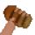

# Значки в профиле

## Официальные значки

 - День рождение. Выдаётся в день рождение по запросу в поддержку навсегда.

 - Голосовальщик. Выдаётся автоматически если проголосовать за бота более 25 раз.

 - Переводчик. Для людей, которые смогли перевести бота на другой язык с минимальными ошибками на достаточное количество строк.

 - Разработчик. Выдаётся только разработчикам бота, никак невозможно получить.

 - Модератор. Выдавался за активную помощь разработчикам в наказании плохих людей и за ответ на новые идеи пользователей. Значок был удалён, тут он остался в знак памяти о существовании.

 - БагХантер. Для людей которые смогли найти более 20 багов в боте и тем, кто активно их ищет.&#x20;

.gif>) - Донатер. Для людей купивших FlameOut **Premium** или персональный значок.

 - SCAM. Для тех, кто смог обмануть одного или нескольких разработчиков. А ещё выдаётся тем, кто получил бан в боте или на discord-сервере.

 - OLD. Выдаётся по запросу в поддержку тем, кто зарегистрирован в боте более 7 месяцев.

 - Новый год 2022. Выдавался за использование команды **`f!event`** в период с 25 декабря по 10 января 2022 года.

 - Dance. Ты меня не ищи, я страдать и плакать не буду.. :musical\_note::musical\_note::musical\_note:\
P.S: Такого значка нет.. наверное... Что? \*кхм-кхм\* Тебе показалось, я ничего не говорил..

## Пользовательские значки

Кстати, можно купить пользовательский значок и поставить чей-нибудь чужой, но не все владельцы могут разрешить поставить их значок.

 - Монолит. За Монолит! Не будь дураком - вступай в ряды Монолита!\
\-> Владелец: 544830230548840468

 - Сашими\
\-> Владелец: 656853896819376149

 - Дед инсайд. Я дед инсайд, мне 9 лет, я хочу в психокидс\
\-> Владелец: 656853896819376149

 - Амогус. Sus\
\-> Владелец: 656853896819376149

 - SCP-613-1\
\-> Владелец: 505010181911085057

 - Таймер. Просто таймер, ничего более\
\-> Владелец: 544830230548840468

 - Орангутан\
\-> Владелец: ptyanka#8819

.svg>) - Йен. Валюта\
\-> Владелец: 656853896819376149
