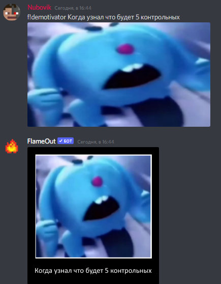

# Создание демотиваторов


На данный момент создание демотиваторов временно недоступно. Мы уже работаем над этой проблемой, чтобы функционал бота стал полностью доступен.


Для начала выберите картинку, которую хотите запихнуть в демотиватор. Я уже выбрал картинку, это кричащий крош.

.png>)

После выбора картинки из интернета выберите картинку в дискорде и пропишите команду **`f!demotivator [желаемый текст]`**. Вот что в итоге примерно должно получиться:

Также демотиватор можно создать с двумя строчками, для этого нужно прописать команду **`f!demotivator [желаемый текст]_[вторая строчка]`**. Пример:

.png>)
