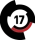

# Значки в профиле

## Официальные значки

###  День рождение

Выдаётся в день рождение по запросу в поддержку навсегда.

###  Голосовальщик

Выдаётся автоматически если проголосовать за бота более 25 раз.

###  Переводчик

Для людей, которые смогли перевести бота (минимум 100 строк) на другой язык с минимальными ошибками.

###  Разработчик

Выдаётся только разработчикам бота, никак невозможно получить.

###  Модератор

Выдавался за активную помощь разработчикам в наказании плохих людей и за ответ на новые идеи/баги пользователей. Значок был удалён, тут он остался в знак памяти о существовании.

###  Баг-хантер

Для людей которые смогли найти более 15 багов в боте и тем, кто активно их ищет.

###  Донатер

Для людей купивших любой донат в боте.

###  SCAM

Для тех кто смог обмануть одного или нескольких разработчиков. А ещё выдаётся тем, кто получил бан в боте или на Discord-сервере. Кстати, разработчики, увидев этот значок сразу поймут что вы кого-то (или их самих) когда-то обманывали, вследствие чего могут выдавать гораздо меньше наград или вовсе их не выдавать.

###  OLD

Выдаётся по запросу в поддержку тем, кто зарегистрирован в боте более 7 месяцев.

###  Новый год

Выдавался в период с 13 декабря 2020 года по 5 января 2021 года; 25 декабря 2021 года по 10 января 2022 года; 30 декабря 2022 года по 31 декабря 2023 года.

###  Dance

Выдаётся за использование команды **`f!event`** в день рождение одного из разработчиков.

###  Трофей

Выдаётся только за первое место в топе по очкам в змейке.

###  Друг проекта

Данный значок будет выдаваться всем тем, кто как либо нам активно или много помогал, или просто людям которых мы уже давно знаем.

## Пользовательские значки

Можно купить пользовательский значок и поставить чей-нибудь чужой, но не все владельцы могут разрешить это сделать. Подробнее в команде **`f!donate`**.


Разработчики FlameOut могут ставить себе любые пользовательские значки независимо от того, запретил ли это делать владелец.


<table data-view="cards"><thead><tr><th></th><th></th><th></th></tr></thead><tbody><tr><td><h3> Монолит</h3></td><td>
За монолит! Не будь дураком - вступай в ряды Монолита!

Значок имеют право ставить только &#x3C;...>.

544830230548840468
</td><td></td></tr><tr><td><h3> GrandWorld</h3></td><td>Это короче сервак майна на случай кто не знал. Это так, для инфы. </td><td>Значок имеют право ставить только участники Discord-сервера владельца.  805881717415346236</td></tr><tr><td><h3> Сундук из Terraria</h3></td><td>Тоже самое, что и коробка, но красивее. </td><td>Значок можно поставить только по разрешению владельца.  805881717415346236</td></tr><tr><td><h3> Sashimi</h3></td><td>Значок имеет право ставить только владелец. </td><td>656853896819376149</td></tr><tr><td><h3> Сок</h3></td><td>Значок имеют право поставить абсолютно все пользователи FlameOut. </td><td>656853896819376149</td></tr><tr><td><h3> Дед инсайд</h3>
Значок можно поставить только по разрешению владельца.
</td><td></td><td>656853896819376149</td></tr><tr><td><h3> Зачарованное яблоко</h3></td><td>Значок имеют право поставить абсолютно все пользователи FlameOut.</td><td> 805881717415346236 </td></tr><tr><td><h3> Амогус</h3></td><td>Значок имеют право поставить абсолютно все пользователи FlameOut.  656853896819376149</td><td></td></tr><tr><td><h3> SCP-613-1</h3></td><td>Значок имеет право ставить только владелец и 449571898884620298.  505010181911085057</td><td></td></tr><tr><td><h3> Йен</h3></td><td>Значок имеют право поставить абсолютно все пользователи FlameOut. </td><td>656853896819376149</td></tr><tr><td><h3> Таймер</h3></td><td>Значок имеют право поставить абсолютно все пользователи FlameOut.</td><td>

544830230548840468
</td></tr><tr><td><h3> Гражданин Сити 17</h3></td><td>Добро пожаловать! Добро пожаловать в Сити 17. Сами Вы его выбрали, или его выбрали за Вас — это лучший город из оставшихся.</td><td> Значок можно поставить только по разрешению владельца.  507301976141463552</td></tr></tbody></table>

###  Рейхсмарка


Дисклеймер: Не одобряем нацизм, фашизм и любые его проявления, не пропагандируем и не пытаемся пропагандировать никакие идеологии. Просим воздержаться от любого типа разговора на эту тему, даже если очень хочется.


Значок имеет право ставить только владелец (584462513731797010).
