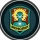
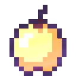
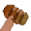
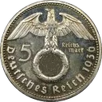

# Значки в профиле

## Официальные значки

###  День рождение

Выдаётся в день рождение по запросу в поддержку навсегда.

###  Голосовальщик

Выдаётся автоматически если проголосовать за бота более 25 раз.

###  Переводчик

Для людей, которые смогли перевести бота (минимум 100 строк) на другой язык с минимальными ошибками.

###  Разработчик

Выдаётся только разработчикам бота, никак невозможно получить.

###  Модератор

Выдавался за активную помощь разработчикам в наказании плохих людей и за ответ на новые идеи/баги пользователей. Значок был удалён, тут он остался в знак памяти о существовании.

###  Баг-хантер

Для людей которые смогли найти более 15 багов в боте и тем, кто активно их ищет.

###  Донатер

Для людей купивших FlameOut **Premium** или пользовательский значок.

###  SCAM

Для тех кто смог обмануть одного или нескольких разработчиков. А ещё выдаётся тем, кто получил бан в боте или на Discord-сервере. Кстати, разработчики, увидев этот значок сразу поймут что вы кого-то (или их самих) когда-то обманывали, вследствие чего могут выдавать гораздо меньше наград или вовсе их не выдавать.

###  OLD

Выдаётся по запросу в поддержку тем, кто зарегистрирован в боте более 7 месяцев.

###  Новый год

Выдавался за использование команды **`f!event`** в период с 13 декабря 2020 года по 5 января 2021 года; 25 декабря 2021 года по 10 января 2022 года.

###  Dance

Выдаётся за использование команды **`f!event`** в день рождение одного из разработчиков.

###  Трофей

Выдаётся на данный момент только за первое место в топе по очкам в змейке. (Значок в разработке, его ещё нет в боте)

## Пользовательские значки

Кстати, можно купить пользовательский значок и поставить чей-нибудь чужой, но не все владельцы могут разрешить это сделать. Подробнее в команде **`f!donate`**


Разработчики FlameOut могут ставить себе любые пользовательские значки независимо от того, запретил ли это делать владелец


###  Монолит

За Монолит! Не будь дураком - вступай в ряды Монолита!\
└ Этот значок имеют право ставить только\
└ Владелец: 544830230548840468

###  GrandWorld

Эт крч сервак майна на случай кто не знал. Это так, для инфы\
└ Этот значок имеют право ставить только те, кто находится на Discord-сервере владельца\
└ Владелец: 805881717415346236

###  Сундук из Terraria

Тоже самое, что и коробка, но красивее.\
└ Этот значок можно поставить только по разрешению владельца\
└ Владелец: 805881717415346236

###  Сашими

└ Этот значок имеет право ставить только владелец\
└ Владелец: 656853896819376149

###  Дед инсайд

Я дед инсайд, мне 9 лет, я хочу в психокидс\
└ Этот значок имеют право ставить все пользователи по разрешению владельца └ Владелец: 656853896819376149

###  Зачарованное яблоко

Да прибудет с тобой сила змейки\
└ Этот значок имеют право ставить все пользователи\
└ Владелец: 656853896819376149

###  Амогус

└ Этот значок имеют право ставить все пользователи\
└ Владелец: 656853896819376149

###  SCP-613-1

└ Этот значок имеют право ставить только владелец и 449571898884620298\
└ Владелец: 505010181911085057

###  Таймер

Просто таймер, ничего более\
└ Этот значок имеют право ставить все пользователи\
└ Владелец: 544830230548840468

###  Орангутан

└ Этот значок имеют право ставить все пользователи\
└ Владелец: ptyanka#8819 (id не нашёл)

###  Йен

└ Этот значок имеют право ставить все пользователи\
└ Владелец: 656853896819376149

###  Рейхсмарка

└ Этот значок имеет право ставить только владелец\
└ Владелец: 584462513731797010
