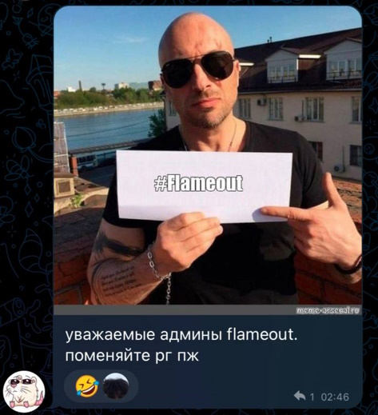

# 📢 Список изменений

Маленькие кликабельные ссылки для быстрого перемещения: [\[3.0.3\]](upd.md#3.0.3) • [\[3.0.2\]](upd.md#3.0.2) • [\[3.0.1\]](upd.md#3.0.1) • [\[3.0.0\]](upd.md#3.0.0) • [\[2.1.2\]](upd.md#2.1.2) • [\[2.0.25\]](upd.md#2.0.25) • [\[2.0.24\]](upd.md#flameout-2.0.24) • [\[2.0.23\]](upd.md#flameout-2.0.23) • [\[2.0.22\]](upd.md#flameout-2.0.22) • [\[2.0.21\]](upd.md#flameout-2.0.21) • [\[2.0.20\]](upd.md#flameout-2.0.20) • [\[2.0.19\]](upd.md#flameout-2.0.19) • [\[2.0.18\]](upd.md#flameout-2.0.18) • [\[2.0.17\]](upd.md#flameout-2.0.17) • [\[2.0.16\]](upd.md#flameout-2.0.16) • [\[2.0.15\]](upd.md#flameout-2.0.15) • [\[2.0.14\]](upd.md#flameout-2.0.14) • [\[2.0.13\]](upd.md#flameout-2.0.13) • [\[2.0.12\]](upd.md#flameout-2.0.12) • [\[2.0.11\]](upd.md#flameout-2.0.11) • [\[2.0.10\]](upd.md#flameout-2.0.10) • [\[2.0.9\]](upd.md#flameout-2.0.9) • [\[2.0.8\]](upd.md#flameout-2.0.8) • [\[2.0.7\]](upd.md#flameout-2.0.7) • [\[2.0.6\]](upd.md#flameout-2.0.6) • [\[2.0.5\]](upd.md#flameout-2.0.5) • [\[2.0.4\]](upd.md#flameout-2.0.4) • [\[2.0.3\]](upd.md#flameout-2.0.3) • [\[2.0.2\]](upd.md#flameout-2.0.2) • [\[2.0.1\]](upd.md#flameout-2.0.1) • [\[2.0.0\]](upd.md#flameout-2.0.0)&#x20;


До 2.0.0 версии бота не нумеровались, и сообщения о обновлениях публиковались в хаотичном порядке, поэтому тут может быть предоставлена не вся информация.



upd 28 Jan, 2023: Чуть позже будет добавлена информация о версиях ниже 2.0.25.


## flameout@3.0.3 

### Добавления 

1. Встречайте — промокоды в FlameOut! Их можно получить при раздачах, конкурсах, розыгрышах, за предложение идей по улучшению бота, за поиск багов и много чего ещё.\
   Ловите промокод: **`4Iy4lcc6`**, действует до 30 марта. Активировать: **`f!promocode`** 🎫
2.  Теперь можно установить свой регион в FlameOut (**`f!setregion <страна> <город>`**) — требуется для доступа к некоторым командам.\

    <figure><figcaption></figcaption></figure>
3. Появилась возможность  укусить другого пользователя, достаточно написать **`f!bite`**. Не пробуйте с @Wumpus, иначе он сильно обидеться
4.  Теперь в справке по командам (**`f!help <команда без префикса>`**) написаны необходимые права для использования команд\

    <figure><figcaption></figcaption></figure>
5. Новая забавная и интересная команда: **`f!gay`**
6. Новая РП команда: **`f!clap`** — хлопайте!

### Исправления

1. Теперь **`f!lyrics`** и **`f!spotify`** являются одной командой так как мы сменили API. Да здравствует снова рабочий **`f!lyrics`**!
2. Сообщения о повышении уровня пофикшены и снова работают
3. Починили команду **`f!hiddenmode`**, теперь снова работает
4. Дуэли снова доступны! Команда **`f!duel`** пофикшена
5. Шар судьбы (**`f!8ball`**) теперь работает корректно.

### Изменения

1.  Обновили команду **`f!lyrics`**. Теперь отображается название альбома (если есть), язык на котором написан текст и ссылки на другие площадки — YouTube, SoundCloud, Spotify\*. Отныне картинка справа в embed будет в более высоком качестве. Вместе с этим, изменили систему поиска лирики, теперь FlameOut должен искать почти все песни\

    <figure><figcaption>
*Spotify по-прежнему недоступен в Российской Федерации
</figcaption></figure>
2. Теперь в **`f!githubrepos`** показывается на 3 репозитория больше
3. Кулдаун для Premium-пользователей на **`f!school`** снижен на 319,3 секунд
4. Увеличено время ожидания активности до 5 минут в **`f!snake`**

### Удаления

1. Команда **`f!choose`** удалена. В будущем возможно появиться снова, но, как всегда, ничего не обещаем :3

### Другое

1.  Обновили обложку в группе ВКонтакте FlameOut\

    <figure><figcaption></figcaption></figure>

## flameout@3.0.2 

### Добавления

1. Новый значок - «Друг проекта». Данный значок будет выдаваться всем тем, кто как либо нам активно или много помогал, или просто людям которых мы уже давно знаем.
2.  Теперь Вам будут приходить в ЛС подобные сообщения от бота.\

    <figure><figcaption></figcaption></figure>
3. Знаем, как много Вы путались (особенно те, кто только недавно начал бота использовать), поэтому теперь команду **`f!profile`** можно вызвать алиасами **`f!balance`**, **`f!money`** и **`f!coins`**.
4.  Теперь если Вам не хватает денег при покупке чего-либо в магазине, бот напишет сколько вам ещё потребуется монет.\

    <figure><figcaption></figcaption></figure>

### Исправления

1. В старом профиле (**`f!profile -o`**) исправлено отображение количества монет пользователя в банке.
2. Фиксануты команды: **`f!pet`**, **`f!checkdomain`** - теперь они снова работают.
3. Исправлено отображение питомца пользователя в **`f!shop`**.
4. Топ по подаркам исправлен и снова доступен.
5.  Исправлено отображение количества значков в профиле.\

    <figure><figcaption></figcaption></figure>
6. Теперь получаемое количество рыбы в **`f!fish`** с Хохли-псом увеличивается в два раза.
7. Исправлена ошибка из-за которой бот мог игнорировать все команды пользователя.

### Изменения

1. Теперь при покупке пользовательского значка нельзя указать своё описание, которое будет указано в GitBook. Вместе с этим, у некоторых ранее купленных значков было убрано описание.
2.  Теперь при попытке воспользоваться несуществующей командой бот будет отправлять до пяти похожих на неё вариантов. Если бот не сможет найти - пользователю будет предложена команда **`f!help`** _(см. 2 скриншот)_.\

    <figure><figcaption></figcaption></figure>
3. В **`f!short`** больше нельзя сокращать ссылки через сервис is.gd.
4. Максимальное доступное количество символов для имени питомца теперь — 9, для пользователей с Premium — 12.
5.  Встречайте - новый дизайн профиля! Старый, конечно же, доступен, достаточно в конце команды добавить **`-o`**.\

    <figure><figcaption></figcaption></figure>

### Удаления

1. Команды **`f!slash`**, **`f!redguyinfo`**, **`f!lettertosantaclaus`** удалены.
2. Упоминание снюса в магазине (**`f!shop`**) убрано.

### Другое

1. С Новым 2023 Годом! Как всегда по традиции поделились с Вами итогами уходящего 2022 года и написали немного приятных слов: [**https://t.me/flameoutupdates/668**](https://t.me/flameoutupdates/668)

## flameout@3.0.1 

### Добавления

1. В команду **`f!botinfo`** добавлено количество алиасов команд
2. Теперь в **`f!userinfo`** отображается также серверный ник
3. Теперь справку по командам (**`f!oldhelp <cmd>`**) можно узнать также используя алиасы
4. Новая команда - **`f!steam`**, благодаря ней можно узнать информацию о игре в Steam не выходя из Discord
5. В **`f!userinfo`** добавлена информация о цвете высшей роли
6. В **`f!avatar`** теперь можно скачать аватарку в форматах JPG, PNG, WEBP и GIF (последнее только если у пользователя стоит анимированная аватарка)
7. В команду **`f!version`** добавлена версия node.js

### Исправления

1. Дюп связанный с сейфом и банком, кажется, пофикшен, и больше не работает
2. Пофикшены команды: **`f!ytsearch`**, **`f!event`**, **`f!8ball`**, **`f!githubprofile`**, **`f!spotify`**, **`f!vimeworldonline`**, **`f!minecraftserver`**, **`f!minecraftplayer`**, **`f!userinfo`**, **`f!vkuserinfo`**, **`f!botinfo`**

### Изменения

1. Команда **`f!event`** была переписана. Теперь ивенты будут начинаться автоматически, в будущем будет выложен список ивентов, который будет постепенно дополнятся.
2. Некоторые категории, такие как “YouTube”, “VK” и “GitHub” переходят в категорию “Информация”.
3. Цена FlameOut Premium увеличена на 20 российских рублей.
4. Цена пользовательского значка повышена на 2 российских рубля.
5. Для Premium пользователей снижен кулдаун. Чтобы узнать кулдаун команды воспользуйтесь командой **`f!help [команда]`**
6. Команда **`f!help`** полностью переписана

### Удаления

1. Удалена команда **`f!roulette`**, в будущем скорее всего будет новая
2. Команды **`f!faq`**,  **`f!vimeworldgames`**, **`f!timeout`**, **`f!setslowmode`**, **`f!rankcard`** удалены

### Другое

1. Telegram-каналу по FlameOut 5 ноября 2022 года исполнился ровно 1 год! 🥳 🎉 🥂
2. Название чата в Telegram изменено, теперь - "FlameChat" _(по результатам голосования)_
3. Счастливого Хэллоуина! [**https://t.me/flameoutupdates/537**](https://t.me/flameoutupdates/537)

## flameout@3.0.0 

### Изменения

1. Обновлён discord.js до последней версии.
2. **`f!help`**, **`f!oldhelp`**, **`f!helpmenu`** - теперь это одна команда

## flameout@2.1.2 

### Добавления

1. Новая команда: **`f!emojify`**, превращает текст в эмодзи
2. Теперь у каждой команды есть кулдаун, в большинстве из команд кулдаун будет от трёх до пятнадцати секунд

### Исправления

1. Исправлена цена FlameOut Premium в **`f!donate`**
2. За голосование на top.gg снова выдаются подарки
3. Теперь команде **`f!perms`** необязательно упоминание конкретного пользователя для просмотра прав

### Изменения

1. Уменьшено количество выпадаемых ресурсов в боксах
2. Теперь для повышения уровня теперь нужно 1504\*текущий\_уровень _опыта вместо_ 815\*текущий\_уровень
3. В связи с сильным падением биткоина из-за текущей ситуации в мире, мы приняли решение увеличить текущую цену биткоина на 10% для поддержания экономической ценности биткоина в FlameOut. 45% будет до возвращения стабильного курса, и вполне возможно что в будущем повысится, зависит от курса.
4. Теперь необязательно писать f!resourceprofile для просмотра своих ресурсов, всё теперь находится в **`f!profile`**

### Удаления

1. Удалены slash-команды: **`action`**, **`anal`**, **`ass`**, **`boobs`**, **`categorystats`**, **`covid19`**, **`fourk`**, **`gonewild`**, **`pgif`**, **`pussy`**, **`staff`**, **`thigh`**, **`translate`**, **`vimeworldgames`**

## flameout@2.1.1 

### Добавления

1. Встречайте - питомцы! Первый питомец - Хохли-пёс, его можно купить в магазине за 500k монет, он на данный момент удваивает количество получаемой рыбы в `f!fish`. Информацию о своём пете можно узнать командой `f!pet`, переименовать пета можно командой `f!pet rename`.
2. Новый значок - трофей. На данный момент выдаётся только за достижение первого места в топе по очкам в змейке.
3. Добавлена справка по командам в которой примеры использования и все алиасы, пример: `f!oldhelp spotify`
4. Теперь можно проверять является ли сайт скамом или фишинговым, команда: `f!checkdomain [ссылка]`
5. Добавлено больше информации в `f!allresources`
6. Новые (slash-)команды: `f!progressbar`, `f!ben`, `f!rofl`, `/hungry`, `/version`
7. Добавлен топ по валютам Minecraft-сервера Hilarious

### Обновления

1. Обновлена команда `f!hypixelstats`, изменён дизайн, добавлено больше информации1 и гильдия игрока.
2. Добавлено больше плохих слов в анти-мат.
3. Обновлены (slash-)команды `f!minecraftserver`, `f!8ball`, `/version`
4. Теперь игроки не могут грабить других игроки у которых нет 15 уровня
5. Теперь сообщение о повышении уровня удаляется автоматически через 10 секунд
6. Обновлены вопросы и текст в `f!lettertosantaclaus`

### Исправления

1. Исправлено отображение цветной роли в `f!userinfo`, и команда `f!donate`
2. Исправлены некоторые ошибки в команде `f!rob`

### Изменения

1. Немного повышены цены на сейф, а также снижено макс кол-во находящихся в нём монет

### Удаления

1. Удалены сообщения из `f!profile` в которых призывалось подписаться на другие ресурсы бота помимо Discord и Telegram, в частности из-за многочисленных просьб (изменено)

### Другое

1. Нашему сабреддиту ([https://reddit.com/r/flameout](https://reddit.com/r/flameout)) исполнилось 3 месяца

## flameout@2.1.0 

### Добавления

1. Встречайте - локализация слеш-команд! По идее их теперь можно использовать на русском, укр. и англ. языках. Название и описание slash-команд зависит от выбранного пользователем языка в настройках Discord, ответ бота зависит от языка сервера (изменить язык на сервере можно командой `f!language`).
2. В бота добавлены сейфы (`f!safe`), их невозможно никак ограбить. Теперь можно не волноваться что Вас ограбят или курс биткоина упадёт. Прямо сейчас улучшать сейф можно бесконечно, в будущем его можно будет улучшить только до 15 уровня. Улучшение сейфа прямо сейчас стоит `715000*уровеньсейфа` монет, положить в сейф можно `1850000*уровеньсейфа`.
3. Теперь можно покупать товары в магазине в большом количестве. Достаточно после ID товара написать желаемое количество, например: `f!shop buy 1 50`.
4. Новая команда: `f!changeservername`, изменяет название сервера. Пока что доступна только людям с Premium на ЗБТ сервере.
5. Новая команда: `f!userinfo`, позволяет получить информацию о пользователе (активность, значки, роли и т.д.) ⁣
6. Новая (слеш-)команда: `f!spotify`, позволяет узнать информацию о указанном треке.
7. Пользователям с Premium снижена комиссия с 25% до 15% при переводе монет другим пользователям
8. У нас появился сабреддит ([https://reddit.com/r/flameout/](https://reddit.com/r/flameout/)), приглашаем всех посетить его! :3
9. Теперь тот, кто воспользовался командой `f!leaders` будет подчёркнут в списке лидеров.
10. Добавлены прогресс бары, пока что только в `f!categorystats`
11. Новая (слеш-)команда: `f!lyrics`, позволяет получить текст песни
12. Добавлен топ по количеству монет в сейфе и уровню сейфа
13. Новые slash-команды: `/staff`, `/ben`
14. Новые команды: `f!progressbar`, `f!ben`, `f!rofl`

### Исправления

1. Исправлен топ. Раньше, например, из-за трёх скрытых пользователей отображалось на три пользователя в топе меньше.
2. Теперь если пользователь не проголосовал за бота на top.gg в некоторых командах с случайным шансом бот будет присылать сообщение "хотите бесплатно получить подарки?"
3. Исправлена команда `f!bankhack`, теперь точно нужно ждать 10 минут чтобы ограбить пользователя. Теперь выпадает больше дерева в `f!wood` и ресурсов в `f!mine`.
4. В топе больше не отображаются пользователи с 0 чего-либо.
5. Бот снова отвечает на упоминания.

### Обновления

1. Обновлена команда `f!leaders`, немного изменён внешний вид, и ещё теперь отображается больше людей в топе. По многочисленным просьбам пользователей из секретного чата звёздочки с нумерацией пользователей в топе оставил.
2. В командах `f!singing`, `f!thinks`, `f!hungry`, `f!sad`, `f!waiting`, `f!lay`, `f!sleep`, `f!hit`, `f!hug`, `f!kiss` и `f!eat` теперь рандомные гифки, в каждой команде их может быть от 3 до 7 штук.
3. В некоторых командах теперь вместо реакции крестика будет появляться красная корзина.
4. Обновлена команда `f!hypixelstats`, добавлено немного больше информации ⁣об игроке.
5. Теперь у бота статус "неактивен", т.к. он лучше всего подходит под аватарку бота.
6. Теперь чтобы забанить/кикнуть пользователя с сервера необходимо подтвердить действие.
7. Обновлён поп-ит, добавлено больше клеток
8. Обновлена команда `f!version`.

### Удаления

1. Снюс полностью удалён из бота по результатам недавнего голосования на нашем Discord-сервере

### Другое

1. Нашему сабреддиту ([https://reddit.com/r/flameout](https://reddit.com/r/flameout)) исполнилось ровно месяц! :)
2. У нас появилась группа VK ([https://vk.com/flameoutupdates](https://vk.com/flameoutupdates)), приглашаем всех подписаться на неё! :3
3. Цена FlameOut Premium увеличена до 50 российских рублей

## flameout@2.0.25 

### Добавления

1. Добавлен авто-модераторский фильтр "анти-мат". Данный фильтр удаляет сообщения содержащие плохие слова, если какой-нибудь пользователь их отправит. Включить фильтр можно командой `f!badwords`, по умолчанию он будет отключён на сервере. Фильтр находится в ОБТ, поэтому об ошибках сообщайте через команду **`f!bug`**
2. Теперь просматривать информацию о Minecraft сервере командой **`f!minecraftserver`** можно по портам. Раньше можно было только по 25565, нельзя было выбрать свой (есть сервера на которых другие порты)
3. В разделе "разработчики" теперь показывается рандомный эмодзи при выполнении команды **`f!botinfo`**
4. Добавлены прогресс бары, пока что только в **`f!botinfo`** и **`f!categorystats`**

### Исправления

1. Теперь нельзя самого себя грабить в **`f!rob`** и **`f!bankhack`**
2. Исправлены команды: **`f!vimeworldonline`**, **`f!bankhack`**, **`f!try`**, **`f!ytsearch`**
3. Теперь в **`f!botinfo`** написана точная дата создания бота
4. Исправлено отображение банковской карты в профиле
5. Сообщения при повышении уровня теперь снова отправляются

### Удаления

1. Удалена команда **`f!ship`**

## flameout@2.0.24

### Добавления

1.

### Исправления

1.

### Удаления

1.

## flameout@2.0.23

### Добавления

1.

### Исправления

1.

### Удаления

1.

## flameout@2.0.22

### Добавления

1. Теперь в профиле написано, сколько раз вы проголосовали за бота.\
    (2).png>)
2. Теперь можно купить пользовательский значок! Он имеет эмодзи, название и описание которое выберите Вы. Он будет отображаться в вашем профиле у всех пользователей, а так-же будет добавлен в список значков на GitBook. Купить можно в **`f!donate`** за 18 рублей.

### Исправления

1. Команда **`f!textreverse`** снова работает.

## flameout@2.0.21

### Добавления

1. Добавлены банковские карты! Без банковской карты теперь нельзя пользоваться банком. Покупка банковской карты стоит **`15 000`** монет, расторжение договора с банком **`2 500`** монет. Команда: **`f!bankcard`**
2. Генератор писем деду морозу теперь и в Discord! Отвечайте на вопросы, а бот составит текст. Думаю многие видели такие сайты и знают что это :)
3. Добавлен ID сервера в **`f!serverinfo`**
4. Добавлена команда **`f!botlists`**, она показывает на каких бот листах есть FlameOut.

## flameout@2.0.20

## Добавления

1. **Добавлен социальный рейтинг** (истинное название: репутация). В будущем репутация может повлиять на функционал бота у игрока. Прямо сейчас репутацию можно получить за нахождение багов, участие в ивентах, помощи разработчикам и за покупку FlameOut **Premium**. Рейтинг могут добавлять или убирать пользователи раз в 24 часа командой **`f!reputation`**.\
   \
   Рейтинг так же может сниматься за многочисленные нарушения, за получение бана или значка "SCAM"\
   \
   Направление эмодзи в профиле зависит от репутации, если у вас 0 репутации или выше красная стрелка будет направлена вверх, если рейтинг ниже нуля то вниз

## flameout@2.0.19

### Добавления

1.

### Исправления

1.

## flameout@2.0.18

### Добавления

1.

### Изменения

1.

### Исправления

1.

### Удаления

1.

## flameout@2.0.17

### Добавления

1. Добавлены кирки . Они копают больше руды в шахте, а как мы знаем чем больше ресурсов - тем больше денег! А также обновление шахты, теперь от уровня кирки зависит какую руду вы будете получать.
2. Добавлена дата регистрации в FlameOut в профиль.

## flameout@2.0.16

### Добавления

1. Добавлены листики. Информация о них также теперь присутствует в **`f!allresources`**, **`f!leaders`**. А получить их можно тут: **`f!janitor`**, **`f!cointree`**
2. Продажа листиков: **`f!leafsell`**
3. Новые команды: **`f!msnuseat`**, **`f!translate`**

### Удаления

1. Удалена slash-команда **`/together`**

## flameout@2.0.15

### Добавления

1. В slash-командах, где это возможно, бот может упоминать вас. Раньше вместо упоминания был ваш id или слово "вы". Также, если вы упоминаете себя (например в команде /action), будет сообщение которое увидите только вы.
2. Новая команда: **`f!react`**
3. Новая slash-команда: **`f!avatar`**
4. Возвращение значка "День рождение".
5. В команду **`f!ping`** добавлена задержка отправки сообщений.

### Исправления

1. Команда **`f!statusredguy`** снова работает, как и многие другие команды.

### Изменения

1. Команда **`f!botversion`** переименована в **`f!version`**

### Удаления

1. Удалена команда **`f!ytpr`**

## flameout@2.0.14

### Добавления

1. Новая команда: **`f!faq`**. Ответы на часто задаваемые вопросы.
2. Добавлены фоны в **`f!rankcard`**! Теперь фоны можно менять с помощью специального аргумента. Для изменения фона напишите: **`f!rankcard cbg`**

### Исправления

1. Теперь нельзя людям ставить фоны в `f!rankcard` и нельзя поставить багнутый фон из-за которого не работала команда

### Другое

1. В связи с блокировками музыкальных ботов проигрывающих музыку с YouTube было принято решение удалить музыку из бота (хоть она и раньше не работала). Спасибо тем, кто тестировал и использовал музыку.

## flameout@2.0.13

### Добавления

1. Добавлено количество эмодзи и дата создания бота в команду **`f!botinfo`**.
2. Новая slash-команда: **`/vimeworldgames`**
3. Новая руда в шахте - кварц.
4. Добавлено больше алиасов (сокращений) к командам.
5. В команду **`f!oldhelp`** добавлены кнопки.

### Исправления

1. Исправлена ошибка в команде **`f!ping`**
2. Исправлена ошибка в тексте в **`f!rankcard`**.
3. Исправлена команда **`f!perms`**.
4. Длинные никнеймы в **`f!rankcard`** теперь отображаются правильно.
5. После продажи редстоуна счётчик показывал **`null`**.
6. Исправлена команда **`f!event`**.

### Изменения

1. Процент биткоина повышен до **`35%`** (скриншот голосования ниже)\
   
2. Теперь в боксах выпадает меньше предметов.

### Удаления

1. Удалена команда **`f!slash`**

## flameout@2.0.12

### Добавления

1. Новый магазин на реакция! Теперь он не такой большой, и с ним легче взаимодействовать.
2. Больше руд в шахте! Новые руды: лазурит, медь, редстоун, изумруды. Так же изменены текстуры всех руд.
3. Новая команда: **`f!amonguscode`**

### Исправления

1. Теперь нельзя упомянуть самого себя в командах **`hug`**, **`kiss`**, **`hit`**.
2. Дюпы с биткоином исправлены

## flameout@2.0.11

### Добавления

1. Новые команды: **`f!rainbow`**, **`f!triggered`**, **`f!wasted`**
2. Добавлены баны. Выдаются в комплекте со значком `SCAM`.

### Исправления

1. Исправлен дюп монет и боксов в магазине.

## flameout@2.0.10

### Добавления

1. Новый значок: Модератор
2. Двойная пенсия для владельцев **FlameOut Premium**!
3. Добавлена пенсия, её можно получать раз в месяц, команда: **`f!pension`**

Исправления

1. Ошибки в тексте в **`f!demotivator`** исправлены.
2. Команда **`f!mopenbox`** снова работает.
3. Цена некоторых предметов в магазине теперь после каждой покупки поднимается.
4. Исправлена ошибка, когда забирались боксы в **`f!mopenbox`** 2 раза.

## flameout@2.0.9

### Добавления

1. Новый значок: **Bughunter**. Выдаётся тем, кто активно ищет баги.

### Обновления

1. Максимальная ставка в кубике для пользователей с FlameOut **Premium** повышена до **`30 000`** монет.
2. Теперь Вы можете играть с ботом в кубик (**`f!cube`**).

### Изменения

1. Процент биткоина повышен до **`40%`**.

### Исправления

1. Команда **`f!minesell`** снова работает.

### Удаления

1. Исправлен баг, когда бот снимал, а не добавлял опыт когда пользователь кушал снюс.
2. Удалена команда **`f!slash`**

## flameout@2.0.8

### Добавления

1. Вернут значок **OLD**. Выдаётся тем кто зарегистрирован в боте больше 7 месяцев.
2. Новая команда: **`f!setslowmode`**. Включает медленный режим в канале.
3. Новая NSFW-команда: **`f!fourk`**.
4. Новая slash-команда: **`/nsfw`**.

### Исправления

1. Команда `f!oldhelp` снова работает.
2. Исправлена ошибка, когда бот продолжал показывать индикатор печатания при некорректном значение в **`f!leaders`**.
3. Исправлена баг, когда забирались боксы в которых не было ресурсов в двойном количестве. Пользователям забранные боксы были вернуты.

## flameout@2.0.7

### Исправления

1. Исправлен дюп монет при выводе монет в **`f!bank`**
2. Исправлен дюп монет в команде **`f!cube`**
3. Теперь самому себе нельзя дарить снюс.
4. В **`f!paybitcoin`** при переводе самому себе убрана ссылка на Yandex Health.
5. Теперь можно указать только числовую ставку в **`f!cube`**

## flameout@2.0.6

### Исправления

1. Немного изменил команду **`f!redguyinfo`**, теперь там нет ошибок.

## flameout@2.0.5

### Исправления

1. Команды **`f!redguyinfo`** и **`f!redguystats`** снова работают.

### Изменения

1. Теперь из боксов не выпадают боксы.

## flameout@2.0.4

### Добавления

1. Добавлено итоговое количество использованных команд в **`f!categorystats`**

## flameout@2.0.3

### Добавления

1. Теперь в боте есть сообщения о повышение уровня. Включить можно командой **`f!levelup`**

## flameout@2.0.2

### Исправления

1. Пофикшены команды: **`f!snake`**, **`f!help`**, **`f!popit`**, **`f!minesell`**, **`f!fishsell`**

## flameout@2.0.1

### Изменения

1. Немного изменены команды **`f!donate`** и **`f!botinfo`**
2. Цена на FlameOut **Premium** понижена с на 25 рублей.

## flameout@2.0.0

### Добавления

1. Теперь в боте можно ставить префиксы! Команда: **`f!setprefix`**
2. Новая команда, которая позволяет менять язык в боте: **`f!language`**
3. Добавлена команда: **`f!rankcard`**
